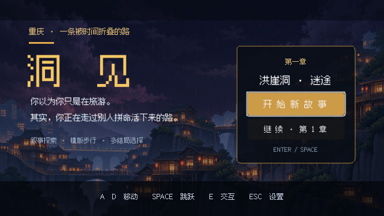
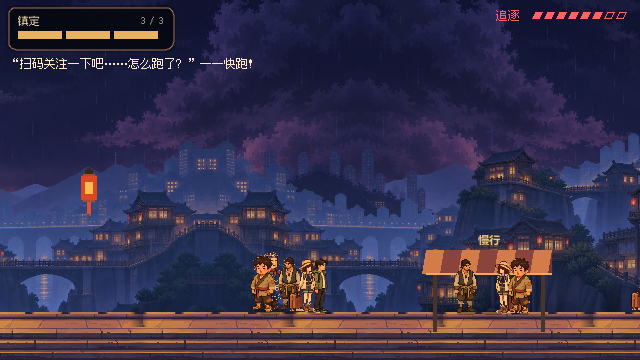
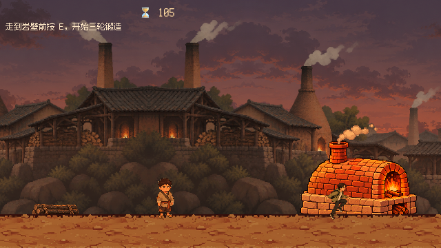
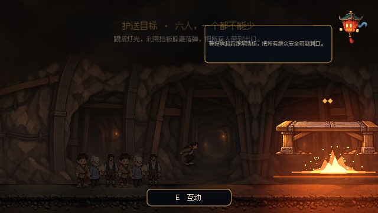
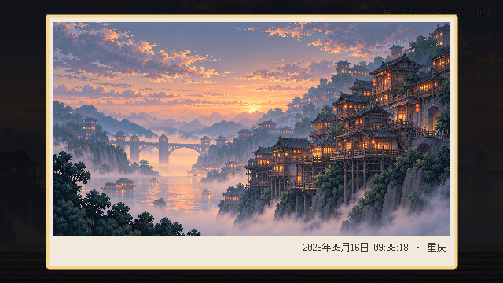

# 洞见 · 一条被时间折叠的路

《洞见》是一款以重庆城市记忆为主题的 2D 横版剧情冒险 Demo。玩家扮演急着前往洪崖洞打卡的现代青年陈默，在躲避传单推销与穿行人群时误入历史残影，先后走进磁器口窑场、中山古镇和战时防空洞，最终回到当代洪崖洞。

> 你以为你只是在旅游。其实，你正在走过别人拼命活下来的路。



## 游戏特色

- 五个章节对应重庆的不同时代与地点，每关拥有不同玩法，而非重复跑图。
- 第一关是人群阻挡下的追逐战；第二关采用移动判定条完成窑场操作链；第三关围绕护送、货物状态与诚信选择展开；第四关需要带领群众躲避逐渐加密的轰炸；第五关用自由探索与实时日期照片回收叙事。
- 分层视差背景、像素角色动画、剧情漫画、传送门转场、临时爆炸照明与独立环境声共同塑造场景。
- 可拖动的重庆元素互动精灵“渝灯”会主动讲解时代背景，并对点击、拖动做出回应。
- 失败、选择与叙事主题绑定：急躁、诚信、责任和“是否真正看见一座城”都通过玩法呈现。

## 实机画面

| 洪崖洞追逐 | 磁器口窑场 |
| --- | --- |
|  |  |

| 防空洞护送 | 洪崖洞归来 |
| --- | --- |
|  |  |

## AI 原生开发实践

AI 深度参与了从设计到验证的完整生产流程，而不只是生成几张图片：

- **内容生产**：角色、互动精灵、剧情插画、场景物件和分层背景经过提示词设计、透明底处理、像素风统一与实机场景校准。
- **机制迭代**：根据试玩反馈持续重构追逐、人群阻挡、移动判定条、货物受损、队伍跟随、动态轰炸和多结局拍照逻辑。
- **动态交互**：互动精灵根据章节与时代自动选择科普内容，并提供点击、拖动等上下文反馈。
- **工程验证**：项目内保留针对剧情、音频路由、地面贴合、第四关跟随、跨场景稳定性与片头视频的自动化测试脚本。
- **发布优化**：通过资源审计与导出过滤，将 Windows PCK 从约 140.6 MB 精简至约 79.2 MB，同时保留运行所需素材。

## 技术栈

- Godot 4.7 / GDScript
- CharacterBody2D、Area2D、Animation、CanvasLayer、AudioStreamPlayer、PointLight2D
- 自研对话、剧情导演、关卡状态、互动精灵和音频路由系统
- Windows 桌面导出；分离式 EXE + PCK 发布

## 运行源码

1. 安装 Godot 4.7 或兼容的 Godot 4.x 版本。
2. 克隆仓库后，用 Godot 导入根目录的 `project.godot`。
3. 等待资源首次导入完成，按 `F6`/`F5` 运行项目。

Windows 可执行试玩版不进入 Git 历史，发布时应从仓库的 **Releases** 页面下载，并将 EXE 与 PCK 放在同一目录后运行。

## 项目结构

```text
autoload/   全局状态、剧情、对话、音频与互动精灵
scenes/     主界面、片头、五个章节与角色场景
scripts/    玩家、NPC、玩法系统和 UI 脚本
assets/     当前游戏美术、音频、视频及许可说明
tools/      场景构建、截图与自动化回归测试
docs/       设计资料、AI 原生 Demo 说明与展示图
```

## 操作

- `A / D`：移动
- `Space`：跳跃或确认
- `E`：交互
- `Esc`：设置 / 返回
- 鼠标：点击或拖动右上角“渝灯”

## 素材与许可

第三方字体、CC0 音效及素材来源记录在 [`assets/README.md`](assets/README.md) 和各素材目录的许可文件中。项目中的原创/生成内容与用户提供音频仅用于本 Demo 展示；仓库暂未授予统一的再分发许可。

## 当前状态

这是一个可完整通关的作品集 Demo。Windows 版本包含片头视频、五关主线、两种结局、分章节音乐与环境音，以及面向发布包的回归检查。
